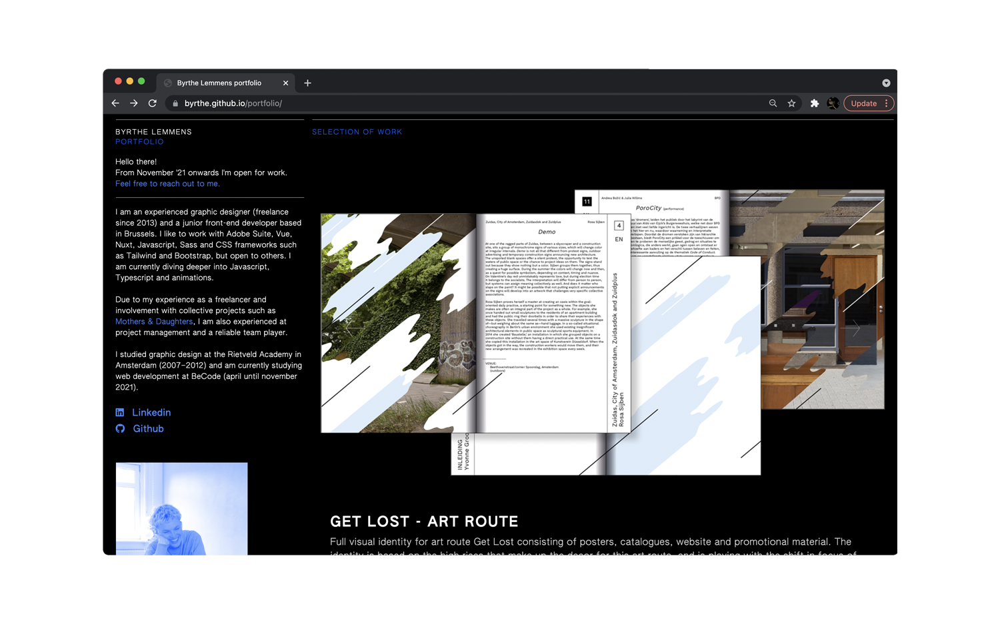
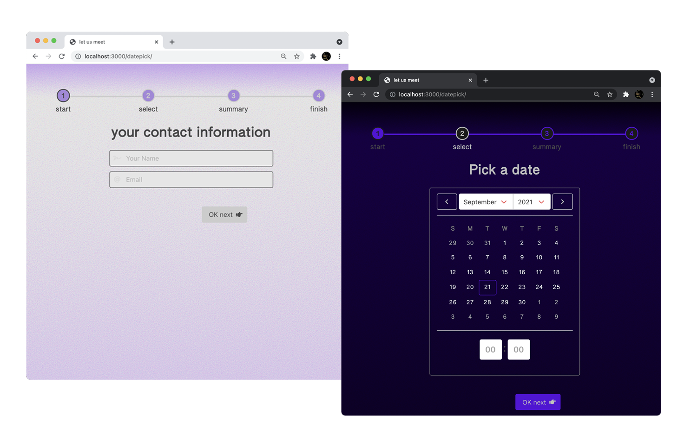
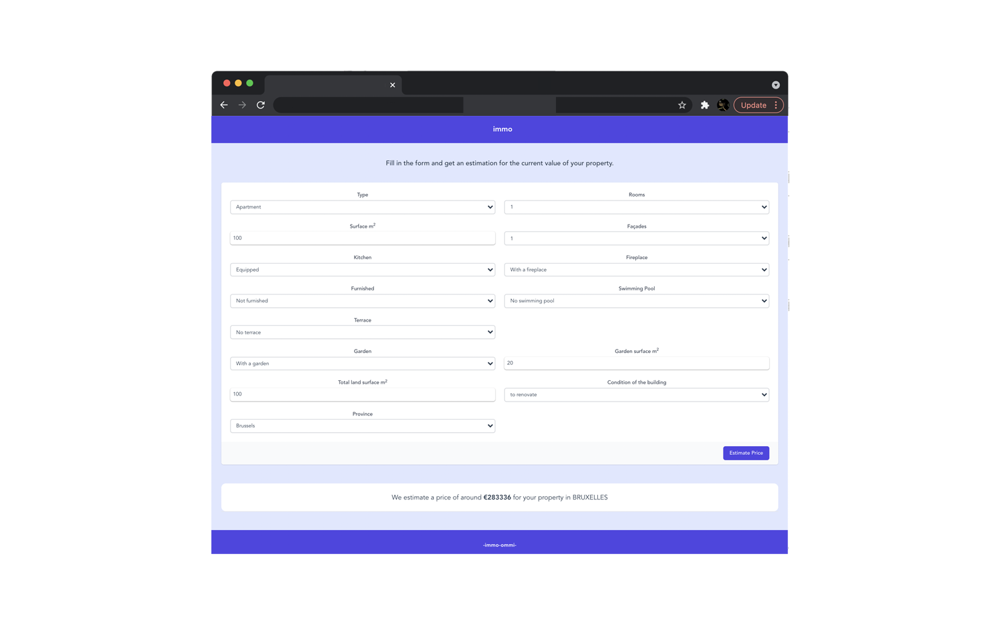
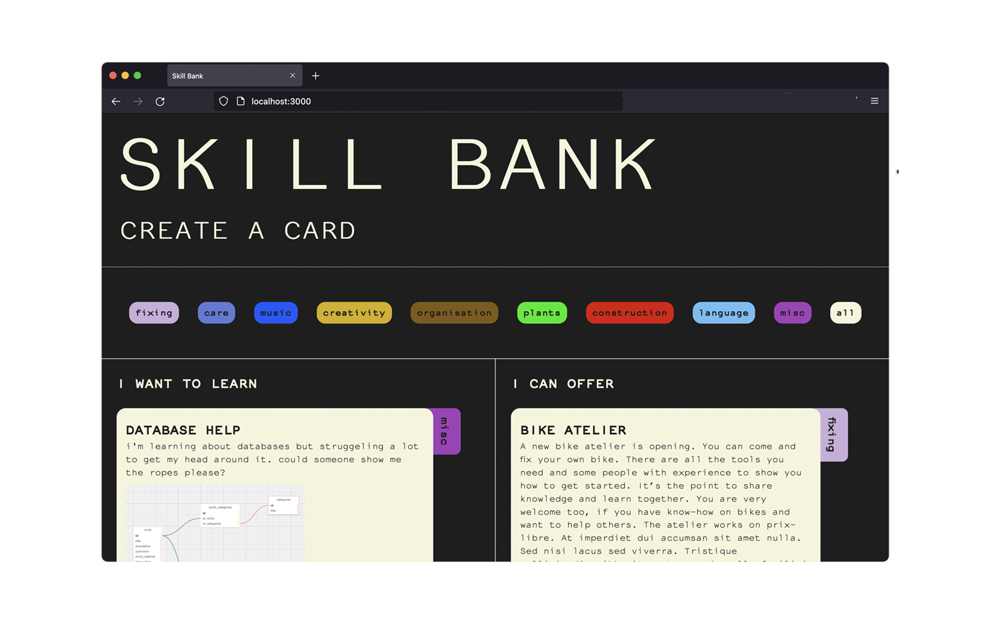
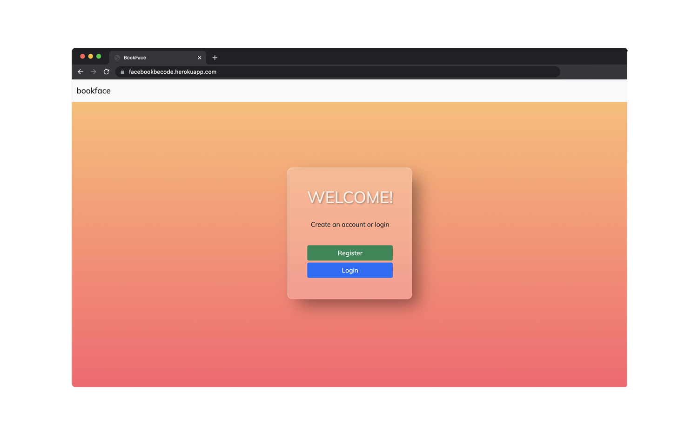

## Hello there 👋

I am a junior front-end developer, an experienced graphic designer and a organisor based in Brussels.
My stack includes: HTML, CSS, SCSS, Javascript, Vue and Nuxt. I'm currently focussing on Javascript and want to get into Typescript and animations soon.

📁 My portfolio of development and design projects [can be found here.](https://byrthe.github.io/portfolio/)

---

## ⚙️ Web development
Currently i'm doing a traineeship at Becode until November '21.

A few of my BeCode projects:

## Portfolio
A small portfolio overview that showcases my graphic design work and development work. I'm still working on extending it with some features. Built with Nuxt, Vue and Bootstrap-vue.
### [website](https://byrthe.github.io/portfolio/)

## date picker component
Still in progres, with this date picker i was focussing on UX and implementing dark mode, while storing the data in the Vuex store. Built with Nuxt and Bulma.
### [Demo](https://byrthe.github.io/datepick/)
### [Repository](https://github.com/byrthe/datepick)

## Immo price estimator 
For this challenge we were asked to interact with GET and POST to an API that was created by a student from the AI class. The API calculates the estimation based on scraped Immo-web data. I used Vue and Tailwind. A project in collaboration with Atefeh Hossein who developed the API. The first load of the API data is rather slow so can take a while...⏱
### [Demo](https://kind-visvesvaraya-ee044c.netlify.app/)
### [Repository](https://github.com/byrthe/vue-immo-app)

## Skillbank
For this project we were asked to explore relational database architecture using SQLite3 and node.js. I made a basic prototype for a skill sharing website. The site is currently deployed without a database, and it's not responsive, but i'd like to work towards that. I used HTML and Bootstrap as a css framework, node and sqlite3.
### [Demo](https://skillbank.herokuapp.com/#)
### [Repository](https://byrthe.github.io/skillBankApp/)

## Bookface
A collaborative project in which we were explored how to work with a non-relational database to create spin off of facebook. We used passport.js for authentication and MongoDB as database. We could register, login, and post on our wall, and see a feed with all the posts in chronological order. We could edit and delete our posts.
The site is deployed but unfortunately due to third party issues, we don't have the database set up anymore.
### [Demo](https://facebookbecode.herokuapp.com/)
### [Repository](https://github.com/byrthe/bookface)

