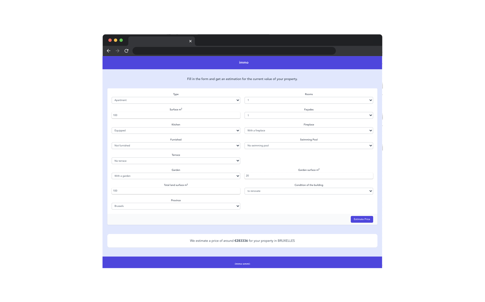

# Hello there

I'm a front-end developer, graphic designer and a organisor based in Brussels.
My stack includes: HTML, CSS, SCSS, Javascript, Vue and Nuxt. I'm currently focussing on Javascript and want to get into Typescript and animations soon.

### [view my portfolio of development and design projects here.](https://byrthe.github.io/portfolio/)

I'm doing a traineeship at Becode until November '21.
Some try-out projects i've worked on the past months while at BeCode:

### Immo price estimator 
In collaboration with Atefeh Hossein who developed the API that calculates the estimation based on scraped Immo-web data.
### [Demo site](https://kind-visvesvaraya-ee044c.netlify.app/)
### [Repository](https://github.com/byrthe/vue-immo-app)

### Skillbank
### [Repository](https://byrthe.github.io/skillBankApp/)

